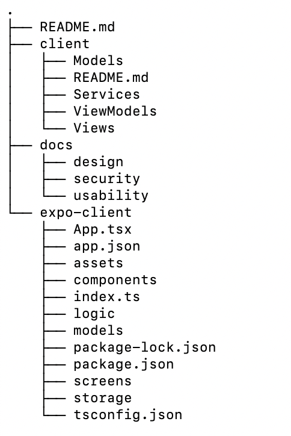

# tabSafe

TabSafe is a privacy-first medication tracking web app built for people who want to manage their medications without handing their health data over to a server. Everything stays on your device, encrypted with your PIN. No accounts, no cloud, no data leaving the browser.


## Table of contents

- [Running the App](#running-the-app)
- [Project Structure](#project-structure)
- [About the `client/` Folder](#about-the-client-folder)
- [Encryption & Security](#encryption--security)
- [Future Security Improvements](#future-security-improvements)

## Running the app

TabSafe runs in the browser using React Native + Expo Web, so there's no native build step or app store involved.

### Prerequisites

- Node.js (v18 or later)
- npm

### Steps

```bash
# 1. Install dependencies
npm install

# 2. Start the development server
npm start

# 3. Press W to open in the browser
#    Or go to http://localhost:8081 directly
```

When you first open the app you are asked to create a PIN and set a recovery answer. That PIN is what encrypts all your data! Don't forget it!


## Project structure 



The project has two main folders at the root: `client/` (the old Swift prototype --> now this is dead code but we kept it here for proof of effort) and `expo-client/` (the active web app). Everything below refers to `expo-client/`.

### Screens

**`UnlockScreen.tsx`**
The first thing users see. Handles three different states: creating a new PIN (new user), entering an existing PIN (returning user), and recovering access via a security question (forgot PIN). Once the user is authenticated, the PIN gets stored in memory for the session and the rest of the app loads.

**`HomeScreen.tsx`**
The main screen. Shows all saved medications. From here users can navigate to a medication's detail view or add a new one.

**`AddMedicationScreen.tsx` / `EditMedicationScreen.tsx`**
Forms for adding or editing a medication. Both save changes back to the encrypted vault.

**`MedicationDetailScreen.tsx`**
Shows the full details for a single medication and links to its schedule.

**`ScheduleScreen.tsx` / `EditScheduleScreen.tsx`**
Lets users view and manage the dose schedule for a medication (frequency, times).

**`HistoryScreen.tsx`**
A log of every time a medication was added. Still in progress, will be updated for medication taken (toggle based?).

**`SettingsScreen.tsx`**
Controls for notification privacy mode, privacy away mode, biometrics, backup, and logout. The details of these are still being implemented. Logging out clears the in-memory PIN so the vault is locked until the user logs back in.

### Logic layer

**`authLogic.ts`**
Handles everything related to PINs and recovery: hashing, storing, and verifying. Raw PINs are never saved anywhere, only their SHA-256 hashes. Uses `expo-crypto` for hashing.

**`medicationLogic.ts`**
CRUD functions for medications. Every read and write goes through the encrypted vault in `localStore.ts`.

**`pinSession.ts`**
Holds the plain text PIN in memory for the current session. This is needed because the PIN is reused as the basis for the encryption key on every vault access. The pin is never written to disk, and clearing it (on logout or page refresh) locks the vault.

**`scheduleLogic.ts`**
Handles creating and updating medication schedules.

**`notificationLogic.ts`**
Manages notification scheduling and the two privacy modes (generic reminders vs. user labeled reminders).

**`settingsLogic.ts`**
Loads and saves the `AppSettings` object. Settings aren't sensitive so they are stored unencrypted.

**`storageEncryption.ts`**
The actual encryption and decryption logic: PBKDF2 key derivation + AES-256-GCM. See Encryption & Security section for a full breakdown.

**`webReminderPopup.ts`**
Web-specific logic for showing medication reminders as browser popups.

### Storage layer

**`localStore.ts`**
The only file that touches AsyncStorage directly. Decrypts the vault when loading and reencrypts it on every save. If no session PIN is available it returns an empty vault rather than exposing data.

## Brief: the `client/` Folder

The `client/` folder is the original Swift/SwiftUI prototype we built at the start of the project. It follows a standard iOS MVVM structure (Models, Services, ViewModels, Views) and is no longer active, but we kept it in the repo for reference.

The original plan was a native iOS app using SwiftUI and the iOS Keychain for secure credential storage, which would have given us access to Face ID/Touch ID and the Secure Enclave. In practice though, native iOS development came with a lot of obstacles: testing required Xcode (which many of us could not download properly on our latops) and a paid Apple Developer account.

We switched to **React Native + Expo Web** so the app could run directly in a browser with no native toolchain. This worked out well because the browser's built-in `crypto.subtle` Web Crypto API gave us access to strong, standardised encryption primitives (PBKDF2 + AES-256-GCM) without needing any third-party libraries. 

## Encryption & Security

The core privacy guarantee of TabSafe is that **medication data is never stored in plain text**. Even if someone gets direct access to the device's local storage, they can't read the vault without the user's PIN.

There are two separate mechanisms at work:

1. **PIN and recovery answer protection** —-> one-way hashing so the raw PIN is never stored
2. **Vault encryption** —-> all medication data is AES-256-GCM encrypted using a key derived from the PIN

### PIN hashing

When a user creates a PIN, TabSafe hashes it with SHA-256 using `expo-crypto` and only stores the hash. At login, the entered PIN is hashed again and compared to the stored hash. The raw PIN never touches disk at any point.

The same approach applies to the recovery answer. Before hashing, answers are normalised by lowercasing and trimming whitespace so that the same word will produce the same hash regardless of how the user inputs it.

### Vault encryption (PBKDF2 + AES-256-GCM)

All medication data is stored as a single encrypted JSON in AsyncStorage under the key `tabsafe_vault`. The encryption is handled in `storageEncryption.ts` using only the browser's native `crypto.subtle` Web Crypto API.

**Key derivation: PBKDF2**

The encryption key is never stored anywhere. Instead it's rederived from the user's PIN on every vault access using PBKDF2:

- Hash function: SHA-256
- Iterations: **600,000** —-> this makes brute-forcing the PIN very expensive
- Salt: a random 16-byte value generated on every encryption call
- Output: a 256-bit AES key

Because a new salt is generated each time, two encryptions of the same data with the same PIN produce completely different ciphertext.

**Encryption: AES-256-GCM**

The derived key encrypts the vault with AES-256-GCM:

- Key size: 256 bits
- IV: a fresh random 12-byte value on every encryption call (this is standard practice)
- Authentication tag: 128 bits 

The stored vault blob contains: `{ ciphertext, iv, authTag, salt }` —-> everything needed to decrypt, except the PIN itself.

**Why `crypto.subtle` instead of a library?**

`crypto.subtle` is the W3C Web Crypto API, built into every modern browser and Node.js runtime. Using it directly means no dependency on external packages that carry the chance that a dependency could be compromised or tampered with.


## Future Security Improvements!!!

- **Multiple security questions** — right now there's only one hardcoded recovery question ("What was the name of your first pet?"). Not only is this question generic, but a better version would let users pick from a variety of questions and set up at least two or three answers, making it harder for someone to guess their way in.

- **Change PIN flow** — there's currently no way to change your PIN without wiping the vault. A `changePin` option (once logged in using the security questions) would improve user experiecne.

- **Biometric authentication** — the settings screen has a biometrics toggle as a placeholder. On native iOS/Android this would use Face ID or Touch ID via Expo LocalAuthentication, with the PIN still used as the underlying encryption key. 

- **Session timeout** — the session PIN currently stays the same until the user logs out or refreshes the page. An autolock after a set idle period would be a helpful security improvement.
